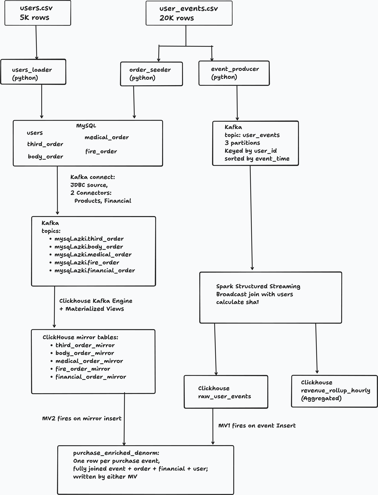

# Azki Senior DE Hiring Task — Technical Report

## 1. Context and brief

The task is a three-part data engineering exercise for an online insurance
aggregator:

- **Part 1** — design an ETL pipeline that reads events from Kafka, joins with
  a MySQL `users` table, and loads aggregated results into ClickHouse.
- **Part 2** — build a denormalized ClickHouse table where purchase events are
  enriched with order details from five MySQL production tables (four product
  tables + `financial_order`), via materialized views. Propose optimizations
  and governance.
- **Part 3** — design a data quality and monitoring plan covering sync/delay,
  missing events, schema drift, and load monitoring. Bonus: Spark backfill.

This report explains the **architecture decisions** behind the implementation.

---

## 2. Architecture overview

The pipeline has four conceptual tiers: **sources** (checked-in CSV files),
**operational** (MySQL + Kafka), **analytical** (ClickHouse), and
**observability** (DQ runner). Two operational tools (`spark-backfill`,
`dq-validator`) sit alongside the main flow.

The headline correctness property: a **four-layer reconciliation invariant**.
The total purchase premium (Toman 134,625,513,655) must match exactly across
`mysql.financial_order`, `ch.financial_order_mirror FINAL`,
`ch.raw_user_events FINAL` filtered to purchases, and
`ch.purchase_enriched_denorm FINAL`. The DQ runner asserts this on a
2-minute cadence.

---

## 3. Part 1 — Ingestion design choices

**Kafka with user_id as the message key.** Events are partitioned across three
Kafka partitions by hash of `user_id`. This guarantees per-user event ordering
(signup → quote_view → click → purchase remain in order), while allowing
parallel consumption. The producer publishes events **sorted by event_time**
before sending, so each partition's stream is also roughly monotonic — this is
what allows the watermark in Spark to be tight (1 hour) without dropping data.

**No Kafka record timestamp.** The producer does **not** pass a `timestamp=`
argument when publishing. Kafka stamps each message with wall-clock time
instead. The business event time stays inside the JSON payload. This decouples
the pipeline from Kafka's retention semantics — data from October 2025 can be
replayed in May 2026 without hitting Kafka's default 7-day retention, because
records appear fresh to Kafka.

**Spark Structured Streaming with foreachBatch JDBC sinks.** The streaming job
reads from Kafka, broadcasts the small `users` dimension table (~5K rows)
fetched once at startup from MySQL, joins on `user_id`, and writes to
ClickHouse via JDBC. The broadcast join avoids shuffles entirely. Two
streaming queries run in parallel: one writes raw enriched events
(`raw_user_events`), the other does a stateful 1-hour windowed aggregation
into `revenue_rollup_hourly` (the Part 1 deliverable). The agg uses `update`
output mode + watermark; ClickHouse's `ReplacingMergeTree(updated_at)` keeps
the latest cumulative emission per `(window_start, channel, city)` grain.

**Idempotency by `event_hash`.** Each event row carries
`sha1(event_time | user_id | session_id | event_type)`. The
`raw_user_events` table is `ReplacingMergeTree(ingested_at)` keyed on
`(event_time, event_hash)`, so any duplicate emission — from a producer
re-run, a Spark checkpoint replay, or the bonus backfill — dedups at merge
time. `SELECT ... FINAL` forces the dedup at query time when needed.

**Explicit `AS column_name` aliases everywhere downstream.** Spark and
ClickHouse both have semantics where a qualified reference like
`e.event_time` produces an output column literally named `e.event_time`
(with the dot). When the MV writer uses name-based mapping, these don't
match the target table's `event_time` column, and the value silently
defaults. Every column projection in MVs and JDBC writes is aliased to its
target name. This was a real bug we hit and one of the more painful
debugging stories.

---

## 4. Part 2 — Denormalized enrichment design choices

**Five separate MySQL tables, not one big polymorphic order table.** Each
insurance product (third-party, body, medical, fire) has fundamentally
different attributes — vehicle make/model versus plan tier versus building
value. A single `orders` table would be 80%+ null per row and force the
application to query JSON or weakly-typed columns. The separation mirrors how
real microservice architectures isolate product domains; a single
cross-product `financial_order` table holds the shared money fields, joined
on the composite key `(order_id, product_type)` because `order_id` alone is
ambiguous (each product table has its own AUTO_INCREMENT).

**`premium_amount` copied verbatim from CSV → MySQL.** The seeder propagates
the exact value from the source CSV into MySQL `financial_order` without
recomputing. This is the foundation of the four-layer reconciliation
invariant: the same number flows through every storage layer and must
remain identical end-to-end. Free correctness test.

**Kafka Connect JDBC source for the CDC step.** Two connectors — one shared
across the four product tables (incrementing column `order_id`), one
dedicated to `financial_order` (incrementing column `financial_id`). JDBC
source allows exactly one cursor column per instance, and the two key
families differ. ClickHouse subscribes to each topic via a Kafka-engine
queue table; a small MV transforms (parses epoch-millis timestamps to
`DateTime`) and writes to the corresponding `*_mirror` MergeTree table.
Each topic becomes three CH objects: queue + MV + mirror.

**Dual materialized views to avoid race conditions.** A single MV firing on
`raw_user_events` INSERT has a known correctness gap: events whose order
data hasn't been mirrored yet would silently miss enrichment (INNER JOIN
returns nothing). The fix is a second MV firing on
`financial_order_mirror` INSERT with the same SELECT body but with FROM
and INNER JOIN inverted. Whichever side arrives last triggers the MV that
actually finds both halves. Duplicate emissions dedup via
`ReplacingMergeTree(_ingested_at)` on `(event_time, event_hash)`. This is
the canonical production pattern for two-stream convergence on a CH denorm.

**Flat schema with product-prefixed columns** (`third_vehicle_type`,
`body_vehicle_make`, etc.). Preserves type safety, makes
product-scoped queries trivial, and avoids the alternatives — sparse
nullable columns with the same names (loses semantic distinction:
`coverage_amount` means different things across products) or a JSON blob
(loses indexing). One `product_type` discriminator tells the analyst
which group of columns is populated.

**Optimizations and governance** (concrete SQL in
`clickhouse/init/04_governance.sql`): bloom-filter and set skip indexes on
`raw_user_events` for high-cardinality and enum filters; a projection on
`purchase_enriched_denorm` ordered by `(product_type, event_time)` for
product-scoped dashboards; three RBAC roles (`azki_admin`, `azki_analyst`,
`azki_service`) with column-level `REVOKE` on `payment_method` /
`financial_id` for analysts; per-role quotas (200 queries/hour). Plus
documented production additions: TLS, audit log retention, row policies,
encryption at rest.

---

## 5. Part 3 — Data quality and observability design choices

**YAML-driven check definitions with a Python runner.** Each check is a
declarative entry in `dq-validator/checks.yaml` specifying its name, type,
severity, interval, and target queries. The runner dispatches by `type:`
to one of six executor functions covering SQL equality, SQL threshold, SQL
nonzero, schema SHA, Kafka lag, and Kafka message-shape validation. YAML
makes checks code-reviewable as text without requiring a custom DSL.

**Two sinks per result** (stdout JSON and `azki.dq_results` table in
ClickHouse). Humans and log aggregators consume stdout; analysts query
historical trends from the CH table (which has a 30-day TTL to keep it
small). In a production deployment we would also expose Prometheus
metrics for Alertmanager + Grafana, but for this self-contained demo two
sinks cover the brief without pulling in another service.

**Schema drift via SHA256 of `SHOW CREATE TABLE`.** Each schema-drift check
asserts that the SHA of the current DDL matches an expected value
checked into the YAML. The runner has a `--bootstrap-schemas` mode that
computes initial SHAs for first-time setup. When a schema legitimately
changes, the PR author must update the SHA in the same commit — forcing
explicit acknowledgement of every schema change. Unintentional changes
(manual `ALTER` in prod) trigger a critical alert within five minutes.

**Spark backfill as a one-shot service with Kafka offset/timestamp range
arguments.** Reuses the streaming-etl image, overriding the entrypoint to
`backfill.py`. Invoked via `docker compose run --rm spark-backfill
--start-timestamp ... --end-timestamp ...`. The job reads a specific
range from Kafka, re-runs the same enrichment pipeline as the streaming
job, and writes to `raw_user_events` — idempotent via `event_hash` +
ReplacingMergeTree. Covers operational recovery scenarios:
checkpoint corruption, code-fix-driven reprocessing, missed time windows.

---

## 6. Trade-offs and what we would add at scale

**JDBC source, not Debezium binlog CDC.** Kafka Connect's JDBC source only
catches inserts (incrementing column). Real production CDC for mutable
tables would use Debezium reading the MySQL binlog, which captures
inserts, updates, and deletes. For this brief — where orders are
immutable once created — JDBC source is sufficient and simpler.

**`local[*]` Spark, single-broker Kafka.** Both run as single containers
because the deliverable must work on a reviewer's laptop. Production
deployments would use a Spark standalone or Kubernetes cluster and a
multi-broker Kafka with RF=3.

**No Schema Registry, no Avro.** JSON without an envelope is sufficient
when schemas live in code (the queue tables explicitly declare the JSON
shape). Production at scale would adopt Confluent Schema Registry or
similar for versioned, validated messages.

**No TLS between containers.** Internal Docker network only; a real
deployment would use mTLS or a service mesh. Mentioned in `governance`
docs as a production gap.

---

## 7. Reconciliation as the project's correctness contract

The single most important property of the entire pipeline is that
`sum(premium_amount)` evaluates to **134,625,513,655 (Toman)** in four
independent storage layers:

| Layer | Query |
|---|---|
| MySQL source of truth | `SELECT sum(premium_amount) FROM financial_order` |
| ClickHouse financial mirror | `SELECT sum(premium_amount) FROM azki.financial_order_mirror FINAL` |
| ClickHouse raw events | `SELECT sumIf(premium_amount, event_type='purchase') FROM azki.raw_user_events FINAL` |
| ClickHouse denormalised | `SELECT sum(premium_amount) FROM azki.purchase_enriched_denorm FINAL` |

These four numbers being identical proves:
1. The CSV's premium total reaches MySQL correctly (order-seeder).
2. Kafka Connect mirrors MySQL faithfully (CDC).
3. Spark preserves the value through its enrichment (streaming ETL).
4. The dual enrichment MVs produce the right row count and correctly join
   to the right financial row per event.

The DQ runner watches this invariant on a 2-minute cadence with severity
`critical`. Any divergence pages someone in production.

---

## 8. Tech stack

Python 3.11, Apache Spark 3.5.1 (PySpark), Kafka 7.6 (KRaft), Kafka Connect
with JDBC source 10.7.4 + MySQL JDBC 8.3.0, MySQL 8.0, ClickHouse 24.3
(ReplacingMergeTree, LowCardinality, MVs, Kafka engine tables, skip indexes,
projections, RBAC), confluent-kafka-python, clickhouse-driver.
